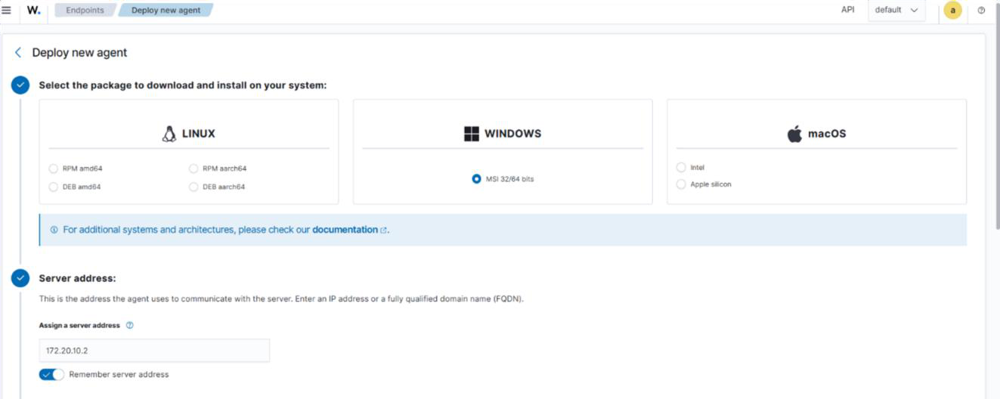
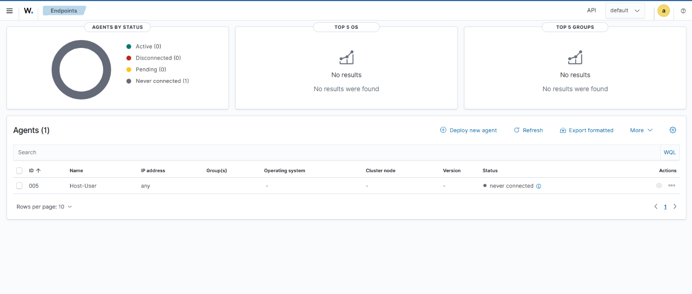
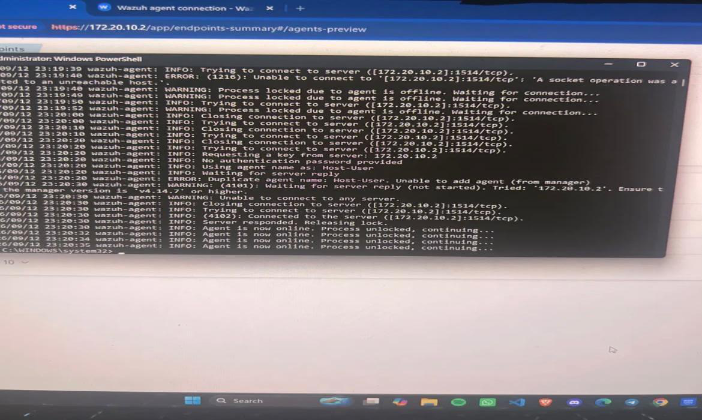
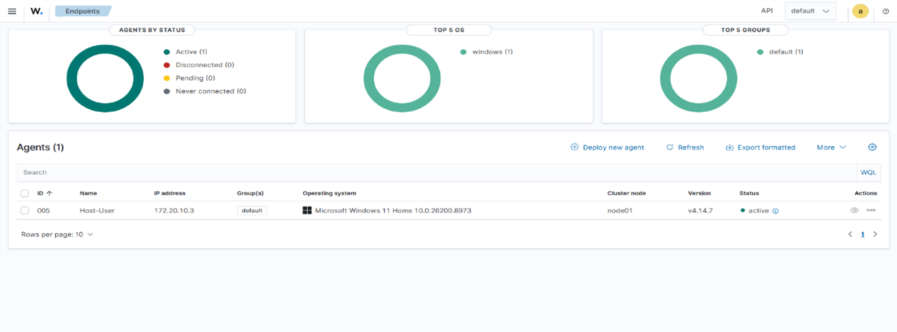
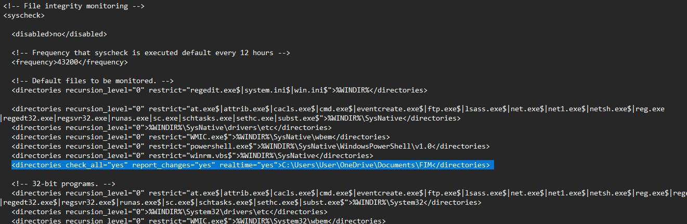
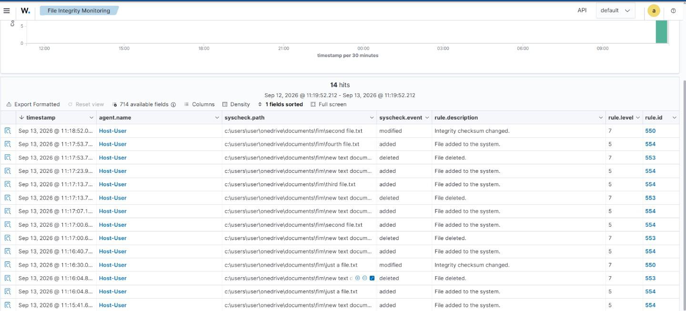
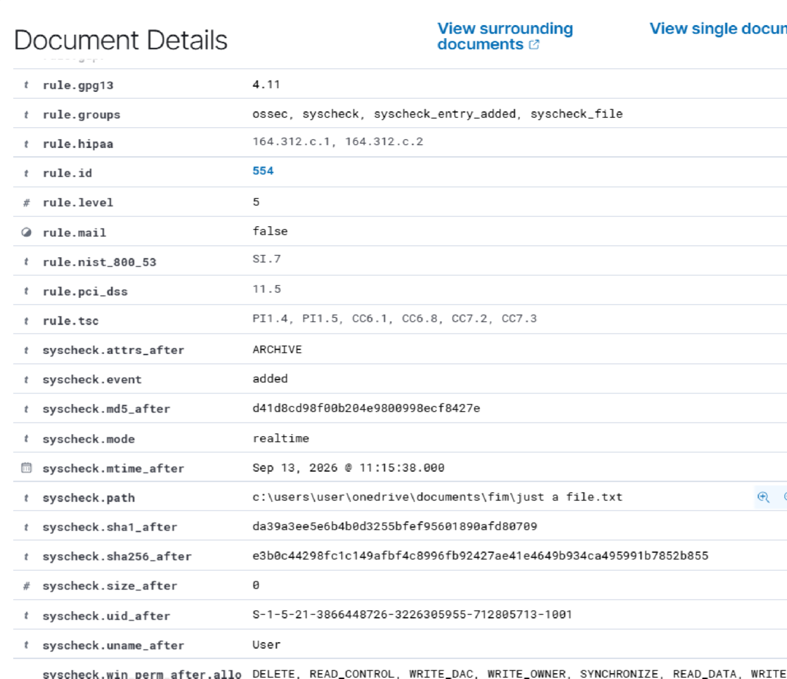

# File Integrity Monitoring with Wazuh

*README: hands-on lab covering agent deployment, troubleshooting, FIM configuration, and validation*

A hands-on lab covering deployment of a Wazuh agent on a Windows host, troubleshooting a real agent enrollment failure, configuring File Integrity Monitoring (FIM) with real-time detection, and validating it against live file creation and deletion events.

**Full step-by-step writeup:** [docs/full-writeup.md](full-writeup.md)

## Environment

| Component | Detail |
| --- | --- |
| Manager | Wazuh v4.14.7, VirtualBox OVA, IP `172.20.10.2` |
| Monitored endpoint | Windows 11 Home, agent `Host-User` (ID 005), IP `172.20.10.3` |
| Monitored path | `C:\Users\User\OneDrive\Documents\FIM` |

## Agent Deployment

Deployed through the Wazuh dashboard's Deploy New Agent wizard (Windows, MSI package), which generated a PowerShell one-liner passing the manager IP and agent name as MSI properties (`WAZUH_MANAGER`, `WAZUH_AGENT_NAME`) to a silent install. Ran it in an elevated PowerShell session, then started the service manually with `NET START WazuhSvc`, since the MSI install doesn't auto-start it. Note the actual service name is `WazuhSvc`, not the display name `Wazuh`.



*Deploy new agent wizard: Windows MSI package, server address set to the manager at 172.20.10.2.*

## Troubleshooting "Never Connected"

The agent registered with the manager but showed "never connected" rather than Active. Worked through it in order of cheapest check first:



*Agent 005 (Host-User) stuck on "never connected" after install.*

**Service status** (`Get-Service -Name WazuhSvc`): running, ruled out.

**Network path** (`Test-NetConnection -ComputerName 172.20.10.2 -Port 1514`): `TcpTestSucceeded : True`, ruling out firewall or VirtualBox networking mode issues.

**Agent log** (`ossec.log`): this is what actually explained it. The manager already had an agent registered under the same name, `Host-User`, from a prior attempt, and Wazuh's `wazuh-authd` enforces unique agent names, so it rejected the new enrollment as a duplicate. Once the stale entry cleared, the agent connected successfully on a later retry.



*The agent log revealing the duplicate agent name rejection, followed by the successful connection.*

Neither the service check nor the network test pointed to the real cause, since neither was actually broken. The log was the only place the root cause showed up, which is a useful reminder to check application logs earlier rather than last.



*Agent 005 confirmed Active after the duplicate registration cleared.*

## Enabling FIM

Added a `<directories>` entry inside the `<syscheck>` block of `ossec.conf`:

```xml
<directories check_all="yes" report_changes="yes" realtime="yes">
  C:\Users\User\OneDrive\Documents\FIM
</directories>
```

- `check_all` turns on full attribute checking, including content hashing, which is not enabled by Wazuh's default subset.
- `report_changes` logs the actual diff of what changed inside a file, not just that a change occurred.
- `realtime` is the attribute that matters most here: without it, this directory would only be checked on Wazuh's default 12-hour scan interval. With it, the agent hooks into the Windows kernel's native file change notification API and detects changes as they happen.

Restarted the agent service afterward, since syscheck changes require a restart to take effect.



*The syscheck block in ossec.conf with the new directories entry, sitting below the default 12-hour frequency setting.*

## Testing and Results

Created four files in the monitored directory and confirmed all four appeared as added events in the dashboard. Deleted three and confirmed the dashboard correctly showed three deleted events, with the remaining untouched file (`Just A file.txt`) still listed and no false event generated for it. No meaningful delay between the file operations and the dashboard update, consistent with real-time detection actually being in effect.



*FIM dashboard showing 14 hits across added, modified, and deleted events, mapped to rule IDs 554, 553, and 550.*



*Alert detail confirming `syscheck.mode: realtime` and all three file hashes populated by `check_all`.*

## Files in This Project

- [`docs/full-writeup.md`](full-writeup.md): full writeup with exact commands, config, log output, and reasoning behind each step
- [`docs/FIM-Wazuh-Documentation.pdf`](FIM-Wazuh-Documentation.pdf): the same writeup as a PDF, for downloading and reading later
- [`images/`](images/): screenshots used in the README and the full writeup
