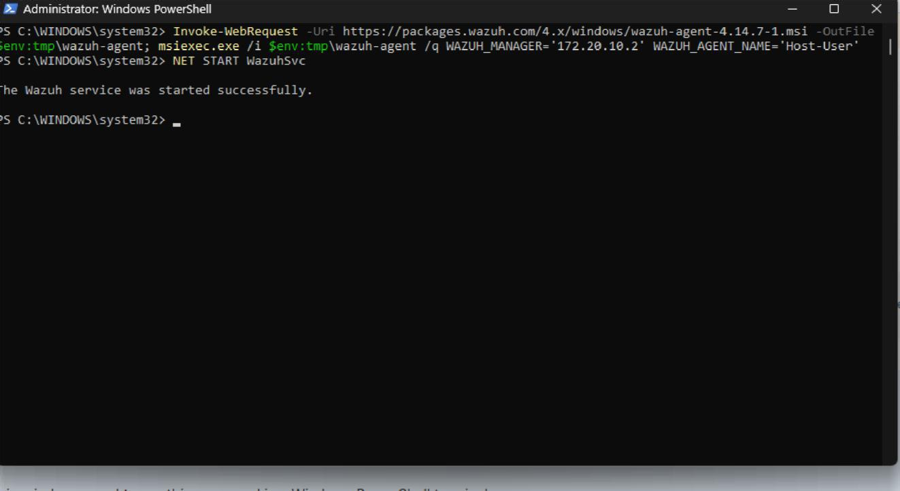
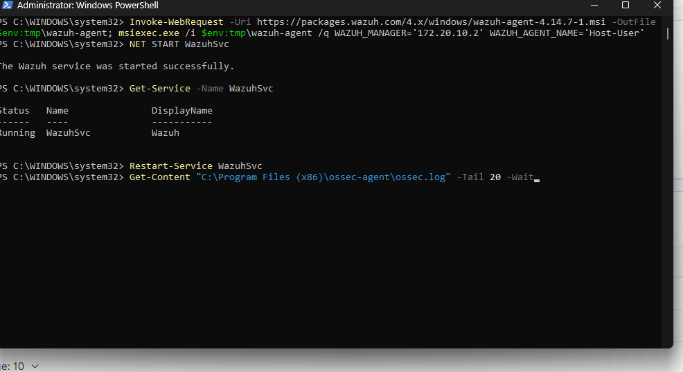
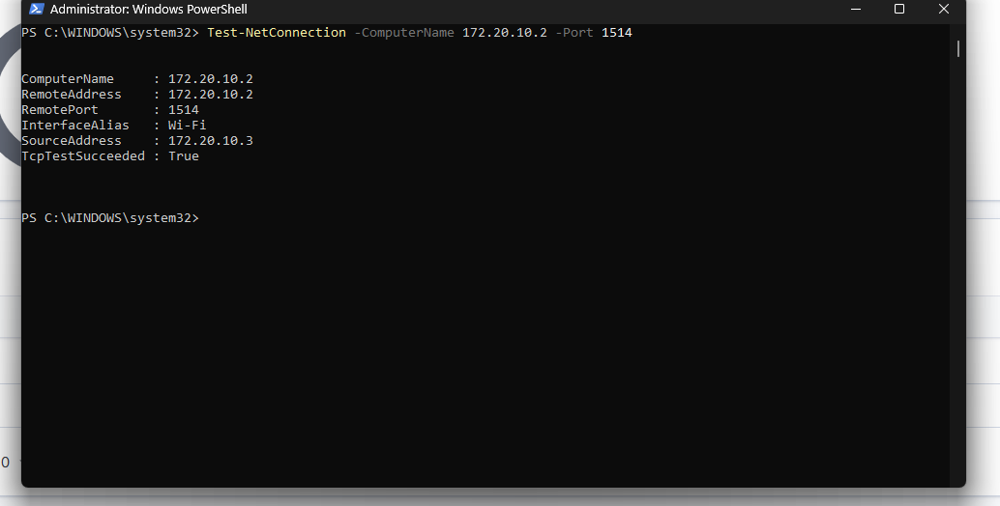
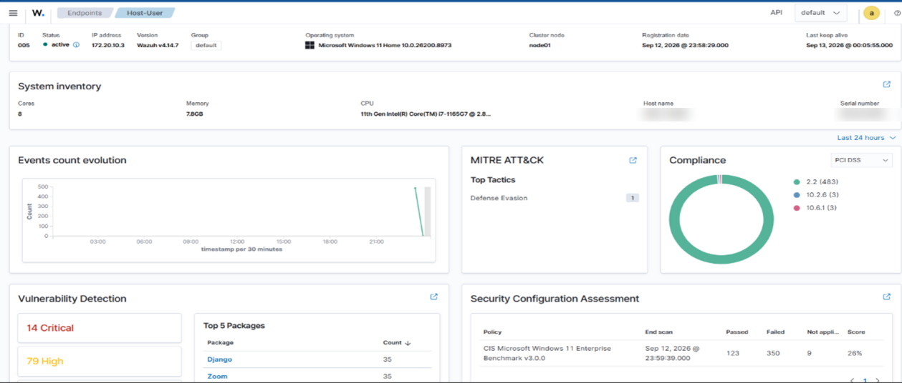
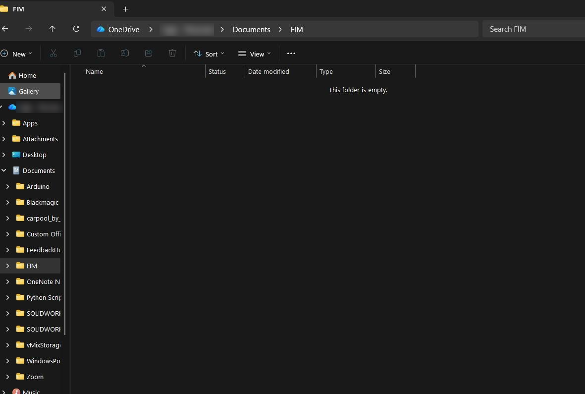
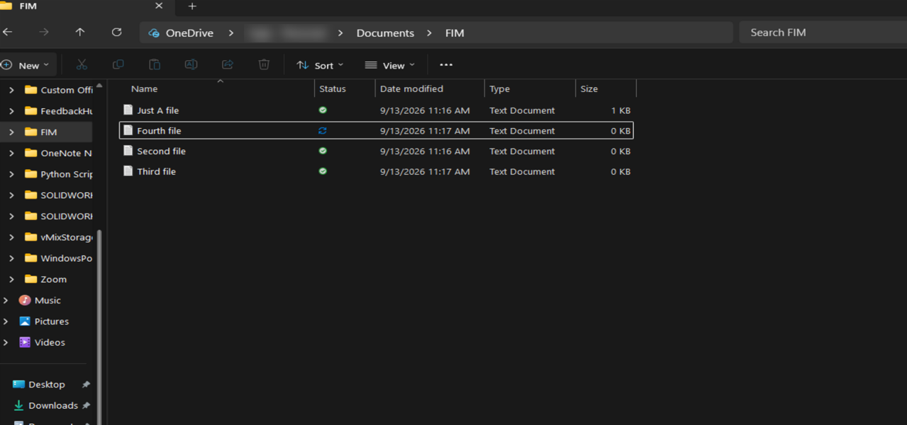
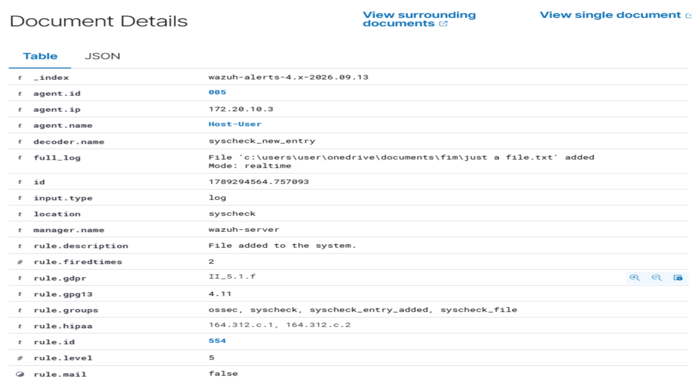
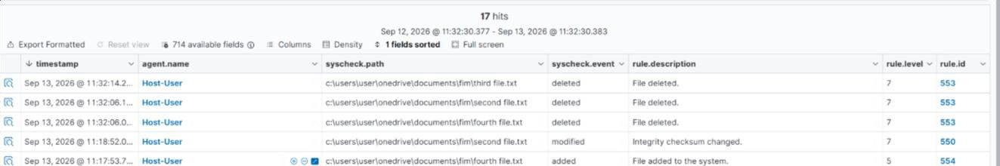

# File Integrity Monitoring with Wazuh

*Deploying a Wazuh agent, troubleshooting enrollment, and validating real-time FIM on a Windows 11 endpoint*

> A PDF copy of this writeup is available for offline reading: [FIM-Wazuh-Documentation.pdf](FIM-Wazuh-Documentation.pdf). For a short overview, see the [README](../README.md).

## Table of Contents

1. [What This Lab Is About](#1-what-this-lab-is-about)
2. [Deploying the Agent](#2-deploying-the-agent)
3. [Troubleshooting "Never Connected"](#3-troubleshooting-never-connected)
4. [Enabling File Integrity Monitoring](#4-enabling-file-integrity-monitoring)
5. [Testing the Configuration](#5-testing-the-configuration)
6. [Results](#6-results)
7. [What This Project Taught Me](#7-what-this-project-taught-me)
8. [Summary](#8-summary)
9. [Resources](#9-resources)

## FIM Setup at a Glance

| Component | Detail |
| --- | --- |
| Manager | Wazuh v4.14.7, VirtualBox OVA, IP `172.20.10.2` |
| Monitored endpoint | Windows 11 Home, agent `Host-User` (ID 005), IP `172.20.10.3` |
| Monitored path | `C:\Users\User\OneDrive\Documents\FIM` |
| Syscheck attributes | `check_all`, `report_changes`, `realtime` |
| Detection latency | Near-instant, via Windows file system change notifications |
| Verified detections | File creation, file deletion, checksum change |
| Rule IDs observed | 554 (added), 553 (deleted), 550 (checksum changed) |

## 1. What This Lab Is About

File Integrity Monitoring is one of the oldest detection mechanisms in the SOC toolkit, and it's still relevant because file system activity is one of the few places almost every attack leaves a footprint, regardless of the initial access vector. A dropped payload, a modified config file, a cleared log, a planted persistence mechanism: all of it shows up as a file event before it shows up anywhere else.

Wazuh's FIM module (called `syscheck` internally, a naming holdover from its OSSEC lineage) works by taking a baseline snapshot of the monitored files and directories, then comparing against that baseline on an ongoing basis. Depending on configuration, it can check things like file size, permissions, ownership, and a cryptographic hash of the file's contents. Any deviation from the baseline gets logged and forwarded to the manager as an event.

There are two fundamentally different ways `syscheck` can operate, and the distinction matters a lot in practice:

- **Scheduled scanning**, the default behavior, where Wazuh walks the monitored paths on a configurable interval (`frequency`, default 12 hours) and diffs against the last known state.
- **Real-time monitoring**, which hooks directly into the OS's native file system event API (`ReadDirectoryChangesW` on Windows, `inotify` on Linux) and reacts to changes as they happen, rather than waiting for the next scan cycle.

For a lab meant to simulate actual detection value, real-time was the only option worth configuring. A 12-hour default scan interval would mean a ransomware event could encrypt an entire directory and sit undetected for most of a workday. That gap is the whole reason this lab exists: to prove the difference between "FIM technically enabled" and "FIM enabled in a way that's actually useful."

**The route I took:**

Deploy Wazuh agent on Windows host → Troubleshoot agent stuck on "never connected" (An Unexpected Encounter) → Edit `ossec.conf` to enable FIM on a target directory → Restart the agent → Create and delete test files → Confirm the events in the Wazuh dashboard

## 2. Deploying the Agent

Before FIM can monitor anything, the machine being monitored needs the Wazuh agent installed, enrolled with the manager, and actively communicating over the agent protocol.

1. Opened the Wazuh dashboard, went to Endpoints, then Deploy new agent.
2. Selected Windows as the operating system and MSI 32/64 bits as the package.
3. Entered the Wazuh manager's IP address, `172.20.10.2`, in the server address field. This is the address baked into the agent's config at install time, telling it where to send enrollment requests and, later, event data.
4. Named the agent `Host-User`. Agent names have to be unique on the manager, which becomes relevant in the next section.


*The Deploy new agent wizard: Windows MSI 32/64 bits selected, server address set to the manager at 172.20.10.2.*

5. Wazuh generated a PowerShell one-liner that downloads the MSI and runs a silent install with the manager IP and agent name passed as MSI properties:

   ```powershell
   Invoke-WebRequest -Uri https://packages.wazuh.com/4.x/windows/wazuh-agent-4.14.7-1.msi -OutFile $env:tmp\wazuh-agent; msiexec.exe /i $env:tmp\wazuh-agent /q WAZUH_MANAGER='172.20.10.2' WAZUH_AGENT_NAME='Host-User'
   ```

   The `/q` flag runs the MSI in quiet mode, no install wizard UI. `WAZUH_MANAGER` and `WAZUH_AGENT_NAME` are MSI public properties the Wazuh installer reads at install time to pre-populate the agent's `ossec.conf`, which is why the config already had the right server address before I ever opened the file manually.

6. Ran the command in an elevated PowerShell session on the Windows host. Elevation matters here since the installer writes to Program Files and registers a Windows service, both of which require admin rights.
7. The MSI install does not auto-start the service, so I started it manually:

   ```powershell
   NET START WazuhSvc
   ```

   Worth flagging for anyone new to Wazuh on Windows: the service's internal name is `WazuhSvc`, while its display name in `services.msc` is just "Wazuh." `NET START Wazuh` (using the display name) fails; you need the actual service name.

8. Went back to the dashboard to confirm enrollment.



*The install command and service start completing successfully in an elevated PowerShell session.*

## 3. Troubleshooting "Never Connected"

The dashboard showed the agent as registered, but its status was "Agent has never connected," with a note that it had been registered but hadn't yet reached the manager. This status specifically means the manager has an agent key on file but has never received a keepalive from that agent, which narrows the possible causes: it's either a network/connectivity problem, a service-level problem, or an enrollment/authentication problem on the manager side.


*Agent 005 (Host-User) registered on the manager but showing "never connected," with no IP, OS, or version data populated.*

I worked through the possible causes in order of how cheap they were to check.

### Service state

Confirmed the agent's Windows service was actually running rather than crashed silently on start:

```powershell
Get-Service -Name WazuhSvc
```

Returned `Running`. This eliminated the simplest possible cause.



*`Get-Service` confirming `WazuhSvc` is in a Running state.*

### Network path

Wazuh agents communicate with the manager over TCP port 1514 (the agent connection service, `wazuh-remoted` on the manager side) and use port 1515 separately for the initial enrollment/key exchange (`wazuh-authd`). Since the agent had already registered, port 1515 clearly worked; the open question was whether 1514 was reachable for ongoing communication:

```powershell
Test-NetConnection -ComputerName 172.20.10.2 -Port 1514
```

Result:

```text
ComputerName     : 172.20.10.2
RemoteAddress    : 172.20.10.2
RemotePort       : 1514
InterfaceAlias   : Wi-Fi
SourceAddress    : 172.20.10.3
TcpTestSucceeded : True
```

`TcpTestSucceeded : True` confirmed a clean TCP handshake against 1514 from the correct source interface. This ruled out the two most common causes of agent connection failures in a VirtualBox lab environment: a misconfigured network adapter mode (NAT vs. Bridged) and Windows Firewall blocking outbound traffic on the agent's egress port.



*`Test-NetConnection` confirming port 1514 is reachable from 172.20.10.3 to the manager at 172.20.10.2.*

### Agent log

With both the service and the network path confirmed healthy, the actual cause had to be somewhere in the application layer, so I went to the source of truth:

```powershell
Get-Content "C:\Program Files (x86)\ossec-agent\ossec.log" -Tail 40
```

The log showed an initial series of connection attempts failing with a generic "unreachable host" socket error, then this exchange once retries continued:

```text
INFO: Requesting a key from server: 172.20.10.2
INFO: No authentication password provided
INFO: Using agent name as: Host-User
INFO: Waiting for server reply
ERROR: Duplicate agent name: Host-User. Unable to add agent (from manager)
```


*The `ossec.log` tail showing the duplicate agent name rejection, followed by the eventual successful connection.*

This was the actual root cause. The manager already had an agent named `Host-User` registered from an earlier attempt (a stale registration from testing the deploy wizard before this run). Wazuh enforces unique agent names on the manager, and when the agent's auto-enrollment process (`agent-auth`) tried to request a key under a name that already existed, the manager's `wazuh-authd` rejected the request outright. The agent kept retrying, and because it kept the same name on each attempt, it kept hitting the same rejection.

A few retry cycles later, the log showed a successful connection:

```text
INFO: (4102): Connected to the server ([172.20.10.2]:1514/tcp).
INFO: Server responded. Releasing lock.
INFO: Agent is now online. Process unlocked, continuing...
```

This is worth understanding rather than just noting: it succeeded because the manager-side registration eventually cleared (the earlier stale entry had aged out or been removed as part of my own cleanup while testing), not because anything on the agent side changed. If that stale entry had stayed in place indefinitely, this agent would have retried forever without ever connecting.

Refreshed the Endpoints page and the agent showed Active, with correct IP, hostname, and OS details populated.


*The same agent now showing active, with IP 172.20.10.3, Windows 11 Home, and version v4.14.7 populated.*



*The Host-User agent overview: system inventory, MITRE ATT&CK tactics, compliance scoring, vulnerability detection, and SCA all reporting.*

**Why this matters as a troubleshooting habit:** the service check and the connectivity test are the two things most guides tell you to check first, and in this case both came back completely clean. Neither one would have led me to the actual fix. The agent log is the only place that showed the true failure mode, which is a decent argument for checking application-level logs earlier in the process rather than treating them as a last resort after exhausting infrastructure checks.

## 4. Enabling File Integrity Monitoring

With the agent active, the next step was configuring `syscheck` to watch a specific directory.

1. Created a folder to monitor: `C:\Users\User\OneDrive\Documents\FIM`
2. Copied the full path.
3. Opened the agent's local configuration through the Wazuh agent manager GUI (Manage → View Configuration), which opens `ossec.conf` directly. This is the same file at `C:\Program Files (x86)\ossec-agent\ossec.conf` that could be edited with any text editor, the GUI is just a convenience wrapper.
4. Located the `<syscheck>` block, which is the section responsible for FIM in Wazuh's config schema (the name is inherited from OSSEC, Wazuh's original codebase, where file integrity checking was called syscheck long before Wazuh existed as a separate project).



*The newly created FIM folder, empty, before any test files were added.*

5. Added a `<directories>` entry inside that block:

   ```xml
   <directories check_all="yes" report_changes="yes" realtime="yes">
     C:\Users\User\OneDrive\Documents\FIM
   </directories>
   ```

Breaking down what each attribute actually controls, since the defaults matter here:

- **`check_all="yes"`** enables every available file attribute check in one shot: size, permissions, owner, group, modification time, and both an MD5 and SHA-1/SHA-256 hash of file contents. Without it, `syscheck` only checks a smaller default subset, and critically, content hashing is not on by default. Content hashing is what lets Wazuh tell the difference between a file that was merely touched (metadata changed) versus a file whose actual contents were altered, which is a meaningfully stronger signal for something like ransomware or a tampered config file.
- **`report_changes="yes"`** tells Wazuh to keep a diff of what actually changed inside the file, not just log that a change event occurred. For text-based files this means the alert can include the actual before/after content difference, which turns a bare "file modified" alert into something an analyst can act on directly instead of having to go find the file and compare manually.
- **`realtime="yes"`** is the attribute that determines detection latency. Without it, this directory would only be checked on Wazuh's scheduled scan interval, which defaults to every 12 hours. With it, the agent registers the directory with the Windows kernel's native file change notification API, so `syscheck` gets notified the instant a file event happens rather than discovering it on the next scheduled pass. This is the single most important attribute for this lab's actual purpose, since the whole point of FIM as a detection control is catching activity close to when it happens, not hours later.

6. Saved the configuration file.
7. Restarted the agent service so the new `syscheck` block would be read on startup:

   ```powershell
   Restart-Service -Name WazuhSvc
   ```

   Wazuh doesn't hot-reload `ossec.conf` changes to `syscheck` without a restart, so this step isn't optional. Skipping it would leave the agent running with its previous configuration, silently, with no error to indicate the new directory wasn't actually being watched.


*The `syscheck` block in `ossec.conf` with the new directories entry highlighted, sitting directly below the default frequency of 43200 seconds.*

Worth noting from the config: the default `<frequency>43200</frequency>` is visible directly above the directories entries. That's 43,200 seconds, or exactly the 12-hour scheduled scan interval mentioned earlier. Seeing the default sitting right next to the `realtime="yes"` override is a useful reminder of what is actually being changed here.

## 5. Testing the Configuration

A working config on paper and a working detection pipeline are two different claims, and only one of them is worth putting in a portfolio. To actually validate it, I generated real file system activity and confirmed Wazuh picked it up correctly and in a reasonable time window.

1. Created four text files inside `C:\Users\User\OneDrive\Documents\FIM`.
2. Checked the File Integrity Monitoring section for the Host-User agent in the Wazuh dashboard. All four files appeared as added events, each with its own checksum recorded at time of creation.
3. Deleted three of the four text files.
4. Refreshed the dashboard. The three deleted files correctly appeared as deleted events, and the remaining untouched file (`Just A file.txt`) stayed listed with no event generated for it, confirming Wazuh wasn't just flagging the directory as a whole but actually tracking file-level state accurately.



*The four test text files created inside the monitored FIM folder.*


*The FIM dashboard showing 14 hits across added, modified, and deleted events, with rule IDs 554, 553, and 550.*

The dashboard mapped these events to three distinct Wazuh rule IDs, which is worth reading rather than skimming past:

- **554** ("File added to the system"), rule level 5, for each created file
- **553** ("File deleted"), rule level 7, for each deletion
- **550** ("Integrity checksum changed"), rule level 7, where a file's contents were altered after creation

The level difference matters. Wazuh scores file creation lower than deletion or modification because a new file appearing is often benign, while a file being removed or having its contents altered is a stronger indicator that something is acting on data that already existed. That is the same severity-reflects-confidence logic that applies to writing detection rules in any SIEM.



*Document Details for a single FIM alert, showing the decoder, full log entry, rule description, and rule ID 554.*

Opening a single alert's Document Details confirmed the configuration was doing exactly what it was set up to do:

- `syscheck.mode: realtime`: direct confirmation that real-time monitoring was active, not a scheduled scan fallback
- `syscheck.md5_after`, `syscheck.sha1_after`, `syscheck.sha256_after`: all three hashes populated, which is `check_all="yes"` working as intended
- `decoder.name: syscheck_new_entry` and `rule.groups: ossec, syscheck, syscheck_entry_added, syscheck_file`
- Compliance mappings automatically attached: PCI DSS 11.5, HIPAA 164.312.c.1 and 164.312.c.2, NIST 800-53 SI.7, GDPR II_5.1.f, and TSC PI1.4/CC6.1/CC7.2


*The same alert scrolled down, showing `syscheck.mode` set to realtime, all three hash fields populated, and the full compliance mappings.*

That last point is worth calling out. Wazuh maps FIM alerts to compliance frameworks out of the box, meaning this same configuration doubles as evidence for a PCI DSS 11.5 or NIST SI-7 control requirement without any extra work. That is a large part of why FIM shows up in compliance audits as often as it does in threat detection.

No meaningful delay was observed between performing the file operations and the events appearing in the dashboard, consistent with `realtime="yes"` actually being in effect rather than falling back to scheduled scanning, and confirmed directly by the `syscheck.mode` field in the alert itself.



*The FIM dashboard after the deletions: 17 hits, with third, second, and fourth file logged as deleted under rule 553.*

## 6. Results

- Wazuh agent successfully deployed and connected on the Windows 11 host, after identifying and resolving a duplicate agent name conflict on the manager via log analysis rather than trial and error.
- FIM enabled on a custom monitored directory with full attribute checking (`check_all`), change-content logging (`report_changes`), and real-time detection (`realtime`) instead of relying on Wazuh's default 12-hour scheduled scan.
- Verified file creation, file deletion, and checksum-change detection through direct, hands-on testing rather than assuming the configuration was correct.
- Confirmed detection latency was consistent with real-time monitoring, not scan-interval-based, verified through the `syscheck.mode: realtime` field on the alerts themselves.
- Confirmed Wazuh automatically mapped the resulting FIM alerts to PCI DSS, HIPAA, NIST 800-53, GDPR, and TSC compliance controls.

## 7. What This Project Taught Me

**A connection failure isn't always a network problem, and infrastructure checks can all pass while the real issue sits at the application layer.** The service was running and port 1514 was reachable the entire time. The actual blocker was a naming collision during enrollment on the manager, something neither a service check nor a `Test-NetConnection` call could ever have surfaced. That's a good argument for reading application logs earlier in a troubleshooting sequence rather than treating them as a last resort.

**Wazuh's FIM defaults are conservative on purpose, and that's a configuration decision, not a limitation.** Out of the box, `syscheck` runs on a 12-hour interval and doesn't hash file contents. That's reasonable for a low-noise, low-overhead baseline deployment across hundreds of endpoints, but it's the wrong default for a directory you actually care about catching changes to quickly. Understanding which attributes shift that tradeoff (`realtime`, `check_all`) matters more than just knowing FIM exists as a feature.

**Testing a detection control is not optional, even when the config looks correct.** A `syscheck` block with no syntax errors and a service that restarts cleanly still doesn't prove anything is actually being monitored. Only generating real file activity and watching it appear correctly in the dashboard, including confirming that deletions and unmodified files were both handled correctly, actually validated the pipeline end to end.

**Agent enrollment on Wazuh enforces name uniqueness at the manager level, which has real operational implications.** Reusing an agent name during repeated testing or redeployment will silently block new enrollments until the stale entry is cleaned up. In a production environment this is worth knowing before automating agent deployment at scale, since a naming collision like this one could stall an entire fleet rollout with an error that isn't obvious from the agent side alone.

**Rule levels encode confidence, not just event type.** Wazuh scoring file creation at level 5 and deletion or checksum change at level 7 isn't arbitrary. It reflects that some file events carry more implied risk than others, which is the same reasoning that goes into assigning severity when writing custom detection rules in any SIEM.

## 8. Summary

I deployed a Wazuh agent to a Windows 11 host through the dashboard's deploy wizard and hit an agent stuck on "never connected." Working through the standard troubleshooting order of service status, then network connectivity, then application logs, the first two checks came back completely clean, and the actual root cause (a duplicate agent name blocking enrollment on the manager) only surfaced by reading `ossec.log` directly. Once the agent was active, I enabled File Integrity Monitoring on a custom directory by adding a `<directories>` entry to the `<syscheck>` block in `ossec.conf`, deliberately configuring `check_all`, `report_changes`, and `realtime` rather than relying on Wazuh's conservative scheduled-scan defaults, since the entire value of FIM as a detection control depends on catching activity quickly. I then validated the configuration with real file creation and deletion tests, confirming the dashboard reflected both event types accurately across rule IDs 554, 553, and 550, with the `syscheck.mode: realtime` field on the alerts confirming real-time monitoring was genuinely in effect rather than just configured on paper.

## 9. Resources

- [Wazuh File Integrity Monitoring documentation](https://documentation.wazuh.com/current/user-manual/capabilities/file-integrity/)
- [Wazuh Agent Enrollment and `wazuh-authd` documentation](https://documentation.wazuh.com/current/user-manual/agent-enrollment/)
- [Wazuh Agent Deployment documentation (Windows)](https://documentation.wazuh.com/current/installation-guide/wazuh-agent/wazuh-agent-package-windows.html)
- [Wazuh Ruleset: syscheck rule IDs 550, 553, 554](https://github.com/wazuh/wazuh/tree/master/ruleset/rules)
